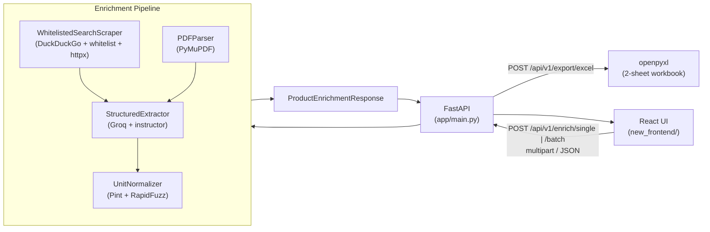

# UniPulse AI


**High-throughput B2B product-intelligence engine.** UniPulse AI turns raw
industrial SKUs (a manufacturer name + part number, an uploaded PDF datasheet,
or a whole catalog file) into clean, normalized, structured specifications —
dimensions, electrical ratings, airflow, pressures, materials, and more — using
web research, LLM extraction, and deterministic unit normalization.

```
┌─────────────────────────────────────────────────────────────────────────────┐
│  PRODUCT IN  →  SKU + PDF/CSV/XLSX  →  web research + LLM extraction        │
│  PRODUCT OUT →  normalized attributes + confidence + Excel export           │
└─────────────────────────────────────────────────────────────────────────────┘
```

---

## Table of Contents

- [Features](#features)
- [System Architecture](#system-architecture)
- [API Specification](#api-specification)
- [Quickstart](#quickstart)
- [Configuration](#configuration)
- [Project Structure](#project-structure)
- [Testing](#testing)

---

## Features

### Single SKU Enrichment
Submit a `manufacturer_name` + `part_number` (optionally a **PDF datasheet**
upload and a free-text description) and receive a fully enriched product
profile. The engine:

1. searches the web for whitelisted technical sources (official manufacturer /
   distributor pages and direct PDF datasheets — consumer retail marketplaces
   are always rejected),
2. parses any uploaded PDF datasheet (PyMuPDF text + table extraction),
3. extracts structured attributes with a Groq-hosted LLM
   (`llama-3.3-70b-versatile`, with an automatic `llama-3.1-8b-instant`
   fallback and exponential-backoff retries on 429/5xx),
4. normalizes every value and unit deterministically, and
5. stamps the exact `source_url` and a `confidence_score` on each attribute.

### Batch Processing
Upload a CSV or Excel catalog (`.csv` / `.xlsx`, up to **500 rows**) and process
every row concurrently with a bounded semaphore — one slow row never sinks the
run. Each row is reported independently with its own status, confidence and
processing time. The client applies **pre-flight validation** (25 MB size cap,
allowed extensions, header/schema guard, empty-file check) before the upload
even leaves the browser, and the batch view shows live **"X / N items
completed"** progress alongside the upload/processing bars. Global LLM
concurrency is capped server-wide (`asyncio.Semaphore(8)`) so two concurrent
batches can't blow through the provider rate limit.

### Pint Unit Normalization
Every extracted `raw_value` is canonicalized through `UnitNormalizer`
(Pint + RapidFuzz):

- **Lengths** — metric → millimeters, imperial → inches (`1 m` → `1000 mm`,
  `2 ft` → `24 in`)
- **Mixed numbers & fractions** — `1 1/2 inch` → `1.5 in`, `3/4 in` → `0.75 in`
- **Ranges** — `20-30 A` → `20-30 A`, `1-2 m` → `1000-2000 mm`, `10/16 mm` → `10-16 mm`
- **Voltage / airflow** — `120 VAC` → `120 V`, `800 CFM` → `800 CFM`
- **Areas** — `5.4 sq in`, `2.5 square feet` → `sq ft`
- **Formatting artifacts** — `1,200 CFM` → `1200 CFM`, Unicode minus `−40` → `-40`
- **Alias registry** — PSI, bar, degF/degC, kVA, percent, thread specs
  (`1/2-14 NPT`), HVAC tonnage (`3.5 tons` → `42000 BTU/h`)

### Multi-Sheet Excel Exporting
Enriched results are rendered into a styled two-sheet `.xlsx` workbook —
**`Products`** (one row per SKU with confidence, timing and cost) and
**`Attributes`** (one row per extracted attribute with normalized value, unit,
confidence and source URL) — with bold headers, sized columns and frozen panes.

### Resilient Web Research
DuckDuckGo search + domain-whitelist filtering with a category-aware mock
fallback: when search is rate-limited or returns nothing, the pipeline still
produces plausible starter-clue spec text (HVAC / Plumbing / Electrical /
General) so extraction has material to work with.

---

## System Architecture



Plain-text equivalent:

```
+------------+    POST /api/v1/enrich/{single,batch}     +----------------------+
|  React UI  | ----------------------------------------> |  FastAPI  app.main   |
| (Vite+TLW) | <---------------------------------------- |  routes + schemas    |
+------------+     JSON response / .xlsx download        +----------+-----------+
                                                                     |
        +------------------------------------------+------------------+
        |                                          |                  |
        v                                          v                  v
+---------------------+                  +-----------------+  +------------------+
| WhitelistedSearch-  |                  |   PDFParser     |  |  StructuredExtr- |
| Scraper             |                  |   (PyMuPDF)     |  |  actor (Groq +   |
| (DDG + whitelist)   |                  +-----------------+  |  instructor)     |
+----------+----------+                                       +--------+---------+
           |                                                            |
           +------------------------------------------------------------+
                                    |
                                    v
                    +-------------------------------+
                    |   UnitNormalizer (Pint + RF)  |
                    +---------------+---------------+
                                    |
              enriched attributes -> response / Excel
```

**Concurrency & resilience notes**

- All blocking work runs off the event loop (`asyncio.to_thread`): DuckDuckGo
  search, PDF parsing, HTML→text extraction, CSV/Excel parsing, workbook
  building, and the LLM call.
- A global `_LLM_CONCURRENCY = asyncio.Semaphore(8)` caps LLM concurrency
  across every request.
- Batch rows run under a per-request `_BATCH_CONCURRENCY = 8` semaphore.
- The LLM layer retries transient HTTP errors (429, 500, 502, 503, 504) with
  exponential backoff + jitter before switching to the fallback model, and
  preserves the original error message if everything fails.

---

## API Specification

Base URL: `http://127.0.0.1:8000` (dev). Interactive docs at
[`/docs`](http://127.0.0.1:8000/docs) (Swagger UI).

### `GET /health`

Liveness probe for load balancers / uptime checks.

**200 OK**

```json
{ "status": "ok", "app": "UniPulse AI", "version": "0.1.0" }
```

### `POST /api/v1/enrich/single`

Enrich one product. Accepts a JSON body (`ProductEnrichmentRequest`) or a
`multipart/form-data` upload with the same fields plus an optional `file`
(PDF datasheet).

**Request — JSON body (`ProductEnrichmentRequest`)**

| Field | Type | Required | Notes |
| --- | --- | --- | --- |
| `manufacturer_name` | `string` | ✅ | e.g. `"Honeywell"` |
| `part_number` | `string` | ✅ | e.g. `"TH6320U2008"` |
| `category` | `"HVAC" \| "Plumbing" \| "Electrical" \| "General"` | ✅ | |
| `raw_description` | `string \| null` | ❌ | extra context / research notes |

**Request — multipart fields**: `manufacturer_name`, `part_number`,
`category` (+ optional `raw_description`, `file`).

**200 OK (`ProductEnrichmentResponse`)**

```json
{
  "sku_id": "Honeywell-TH6320U2008",
  "category": "HVAC",
  "enriched_attributes": [
    {
      "field_name": "voltage",
      "raw_value": "120 VAC",
      "normalized_value": "120",
      "unit": "V",
      "confidence_score": 0.95,
      "source_url": "https://www.honeywellhome.com/..."
    }
  ],
  "overall_confidence": 0.95,
  "processing_time_ms": 4210.5,
  "estimated_cost_usd": 0.000212
}
```

**Errors**

| Status | Meaning |
| --- | --- |
| `400` | Invalid PDF upload |
| `415` | Content-Type is not `application/json` or `multipart/form-data` |
| `422` | Schema validation failed (e.g. unknown `category`) |
| `503` | `GROQ_API_KEY` not configured — extraction unavailable |

### `POST /api/v1/enrich/batch`

Enrich many products from an uploaded file. Multipart field `file` (`.csv` or
`.xlsx`, ≤ 500 rows). Headers are tolerant:

`Manufacturer` (alias `Manufacturer_Name`, `manufacturer`),
`Part_Number` (alias `PartNumber`, `Part Number`, `part_number`),
`Category`, and optional `Description`.

**Request**

```
POST /api/v1/enrich/batch
Content-Type: multipart/form-data
file=<catalog.csv>
```

**200 OK (`BatchEnrichmentResponse`)**

```json
{
  "total": 2,
  "succeeded": 2,
  "failed": 0,
  "results": [
    {
      "sku_id": "Honeywell-TH6320U2008",
      "manufacturer_name": "Honeywell",
      "part_number": "TH6320U2008",
      "category": "HVAC",
      "status": "success",
      "enriched_attributes": [],
      "overall_confidence": 0.95,
      "processing_time_ms": 4012.3
    }
  ]
}
```

Failed rows keep the same shape with `"status": "error"` and an `error`
message carrying the exact failure reason; one bad row never fails the batch.

**Errors**

| Status | Meaning |
| --- | --- |
| `400` | Empty / unreadable upload |
| `415` | File is not `.csv` or `.xlsx` |
| `422` | More than 500 rows |
| `503` | `GROQ_API_KEY` not configured |

### `POST /api/v1/export/excel`

Render enriched results as a downloadable `.xlsx` workbook. Send the array of
enriched product records as the **JSON request body** (recommended — avoids URL
length limits) or via the `data` query parameter.

**Request body**

```json
[ { "sku_id": "...", "category": "...", "enriched_attributes": [ ... ], "overall_confidence": 0.95, "processing_time_ms": 12.5, "estimated_cost_usd": 0.001 } ]
```

**200 OK** — binary `application/vnd.openxmlformats-officedocument.spreadsheetml.sheet`
attachment (`enrichment_export.xlsx`) with `Products` and `Attributes` sheets.

**Errors**

| Status | Meaning |
| --- | --- |
| `400` | Invalid JSON in `data` query parameter |
| `405` | Must be `POST` (browsers can't send GET request bodies) |
| `422` | Payload is not a JSON array / contains an invalid record |

---

## Quickstart

### Prerequisites

- **Python 3.11+** (developed against 3.12)
- **Node.js 18+** (for the React UI)
- A **Groq API key** (https://console.groq.com) — required for LLM extraction

### 1. Backend — virtual environment & dependencies

```bash
# From the repository root
python -m venv venv

# Activate (Windows)
venv\Scripts\activate
# Activate (macOS / Linux)
source venv/bin/activate

pip install -r requirements.txt
```

### 2. Environment configuration

```bash
# Backend keys (root)
cp .env.example .env
#   -> set GROQ_API_KEY=<your-key>

# Frontend keys (new_frontend/)
cp new_frontend/.env.example new_frontend/.env
#   -> VITE_API_BASE_URL defaults to http://127.0.0.1:8000; override if needed
```

### 3. Start the API server

```bash
uvicorn app.main:app --reload
```

- API: <http://127.0.0.1:8000>
- Health: <http://127.0.0.1:8000/health>
- Swagger UI: <http://127.0.0.1:8000/docs>

> Enrichment endpoints return **503** until `GROQ_API_KEY` is set.

### 4. Launch the React UI

```bash
cd new_frontend
npm install
npm run dev
```

Open <http://localhost:5173>. The UI targets the backend directly at
`http://127.0.0.1:8000` (CORS is open for development). For a production
bundle:

```bash
npm run build     # emits dist/
npm run preview   # serve the production build locally
```

### 5. Verify end-to-end

```bash
curl http://127.0.0.1:8000/health

curl -X POST http://127.0.0.1:8000/api/v1/enrich/single \
  -H "Content-Type: application/json" \
  -d '{"manufacturer_name":"Honeywell","part_number":"TH6320U2008","category":"HVAC"}'
```

---

## Configuration

| Variable | Location | Required | Purpose |
| --- | --- | --- | --- |
| `GROQ_API_KEY` | root `.env` | ✅ | LLM structured extraction (Groq) |
| `OPENAI_API_KEY` | root `.env` | ❌ | Reserved / optional alternate provider |
| `GEMINI_API_KEY` | root `.env` | ❌ | Reserved / optional alternate provider |
| `ALLOWED_DOMAINS` | root `.env` | ❌ | Exclusive web-source allow-list (JSON array, e.g. `["example.com"]`); empty = default-allow non-retail domains |
| `CORS_ORIGINS` | root `.env` | ❌ | CORS allow-list (JSON array; default `["*"]` for development) |
| `VITE_API_BASE_URL` | `new_frontend/.env` | ❌ | Backend base URL used by the React UI (default `http://127.0.0.1:8000`) |

See [`.env.example`](./.env.example) and
[`new_frontend/.env.example`](./new_frontend/.env.example).

---

## Project Structure

```
unipluse-ai/
├── app/                          # FastAPI backend
│   ├── main.py                   # ★ app entry point — routes, pipeline wiring
│   ├── core/
│   │   ├── config.py             # pydantic-settings (.env → Settings)
│   │   └── security.py           # domain whitelist / retail-blocklist policy
│   ├── schemas/
│   │   ├── enrichment.py         # request/response Pydantic models
│   │   └── product.py            # product models (placeholder)
│   └── services/
│       ├── scraper.py            # DuckDuckGo search + whitelisted scraping
│       ├── extractor.py          # Groq + instructor structured extraction
│       ├── normalizer.py         # Pint + RapidFuzz unit normalization
│       └── parser.py             # PyMuPDF datasheet parsing
├── new_frontend/                 # ★ React UI (React 18 + Vite 5 + Tailwind 3)
│   ├── src/
│   │   ├── main.jsx              # entry
│   │   ├── App.jsx               # router + app shell
│   │   ├── pages/                # HomePage, SingleSkuPage, BatchCatalogPage
│   │   ├── components/           # TopNav, Toasts, AttributeTable, StatCard…
│   │   ├── context/              # ThemeContext, WorkspaceContext
│   │   ├── services/api.js       # ★ axios API layer (VITE_API_BASE_URL)
│   │   └── utils/format.js       # duration / percent / file-size formatters
│   ├── index.html
│   ├── vite.config.js
│   └── tailwind.config.js        # design tokens (light + dark themes)
├── tests/                        # 96 tests (offline — no API keys needed)
│   ├── test_api.py               # endpoint behavior (fakes for scraper/LLM)
│   ├── test_pipeline.py          # PDF, whitelist, scraper, extraction, retries
│   ├── test_normalizer.py        # unit normalization edge cases
│   └── test_extractor.py         # empty-extraction & truncation signals
├── requirements.txt              # Python dependencies
├── run_frontend.py               # legacy Streamlit dashboard launcher (optional)
└── .env.example                  # backend environment template
```

> The frontend lives in **`new_frontend/`** (the production React app).
> `run_frontend.py` launches a legacy Streamlit dashboard and is kept only for
> reference.

---

## Testing

```bash
# From the repository root (after activating the venv)
pytest -q
```

The suite runs fully offline: network calls and the LLM are faked, so it passes
without API keys or internet access. `96 passed` on a clean checkout.
